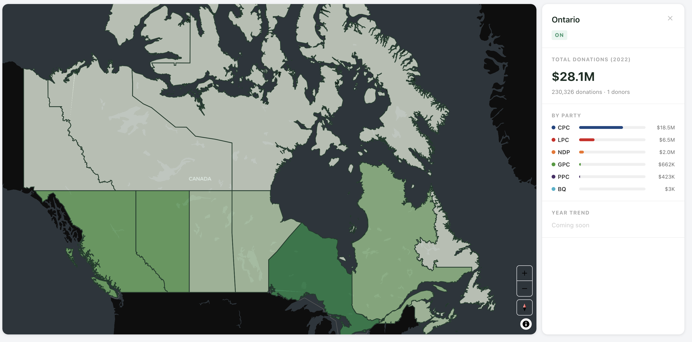
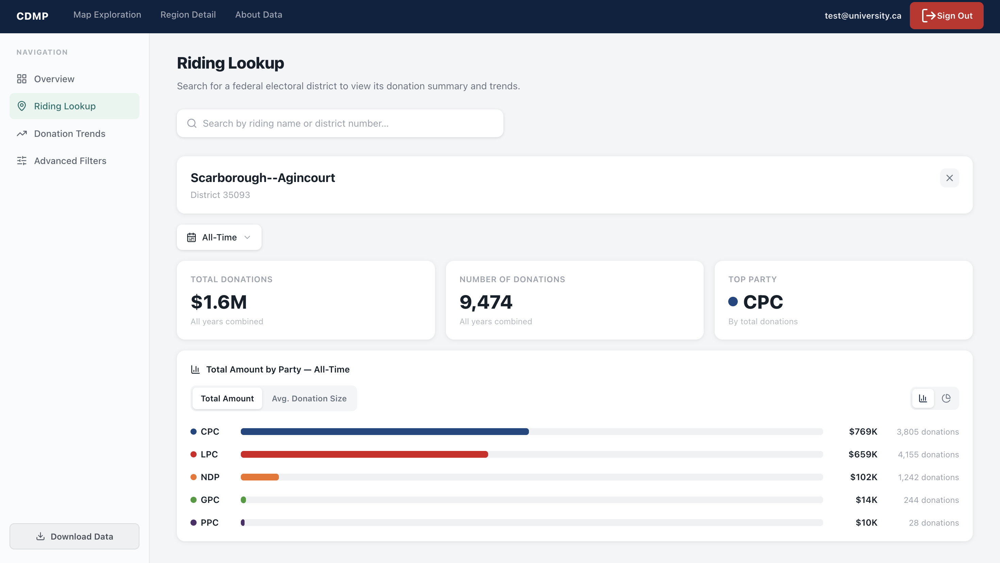
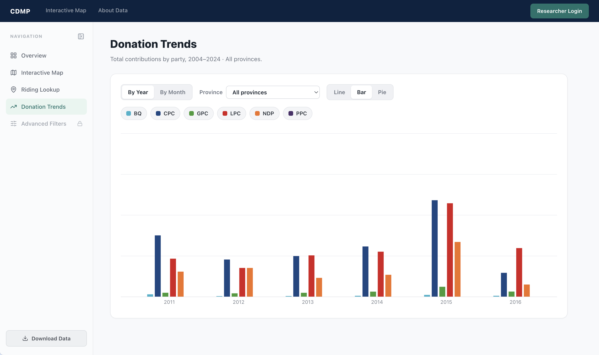

# Canadian Donations Mapping Platform (CDMP)

An interactive web application for exploring Canadian federal political donation data from Elections Canada, allowing users to visualize donation patterns geographically by province, filter by party and year, and for authenticated researchers, access individual-level records.




---

## Local Setup

1. **Clone the repo**
   ```bash
   git clone https://github.com/UTSC-CSCC01-Software-Engineering-I/course-project-the-unemployables.git
   cd course-project-the-unemployables
   ```

2. **Set up environment file**
   Contact the project lead for credentials, then:
   ```bash
   cp .env.example .env
   # fill in the values you received
   ```
   The `.env` file has two sets of credentials:
   - `VITE_SUPABASE_URL` and `VITE_SUPABASE_ANON_KEY` — needed to run the frontend
   - `SUPABASE_URL` and `SUPABASE_SERVICE_KEY` — needed to run the server and Python scripts (e.g. `scripts/normalize_provinces.py`)

3. **Install dependencies and run**

   ```bash
   # Terminal 1 — server (port 3001)
   cd server && npm install && npm run dev

   # Terminal 2 — client (port 5173)
   cd client && npm install && npm run dev
   ```
   Open `http://localhost:5173`

---

## Team Information

**Team Name:** The Unemployables

| Name |
|---|
| Ayyash Anhardeen |
| Akshayan |
| Faris |
| Tri |
| Tareq |

---

## Design Documents

- [Demo 1 Documentation](docs/Demo1Docs.md) — Project proposal, class diagram, Demo 1 status
- [Demo 2 Documentation](docs/Demo2Docs.md) — Updated class diagram, Demo 2 status
- [Demo 3 Documentation](docs/Demo3Docs.md) — Updated class diagram, Demo 3 status
- [Meeting Minutes](meetings/meetings.md)

---

## Tech Stack

| Layer | Technology |
|---|---|
| Language | TypeScript (client + server) |
| Frontend | React 19 + Vite |
| Backend | Express.js 5 |
| Mapping | MapLibre GL JS via `mapcn` |
| Styling | Tailwind CSS v3 + shadcn/ui compatible |
| Containerization | Docker + Docker Compose |
| Database | Supabase (PostgreSQL) — 5.4M donation rows (2004–2024) |
| Auth | Supabase Auth |

---

## Running Locally

### With Docker (recommended)

```bash
docker compose up --build
```

| Service | URL |
|---|---|
| Frontend | http://localhost:5173 |
| API | http://localhost:3001 |

### Without Docker

```bash
# Terminal 1 — server (port 3001)
cd server && npm install && npm run dev

# Terminal 2 — client (port 5173)
cd client && npm install && npm run dev
```

Open `http://localhost:5173`

---

## Running Tests

```bash
# Server tests (grouping logic)
cd server && npm test

# Client tests (map utility functions)
cd client && npm test
```

---

## Software Releases

| Version | Notes |
|---|---|
| [v0.2.1](https://github.com/UTSC-CSCC01-Software-Engineering-I/course-project-the-unemployables/releases/tag/v0.2.1) | Demo 2 release — electoral district map, riding lookup, donation trends, automated tests |
| v0.3.0 | Demo 3 release — multi-year average map, party filter, province performance (materialized views), riding rank + compare, donation trends filters & chart types, 50 automated tests |

---
