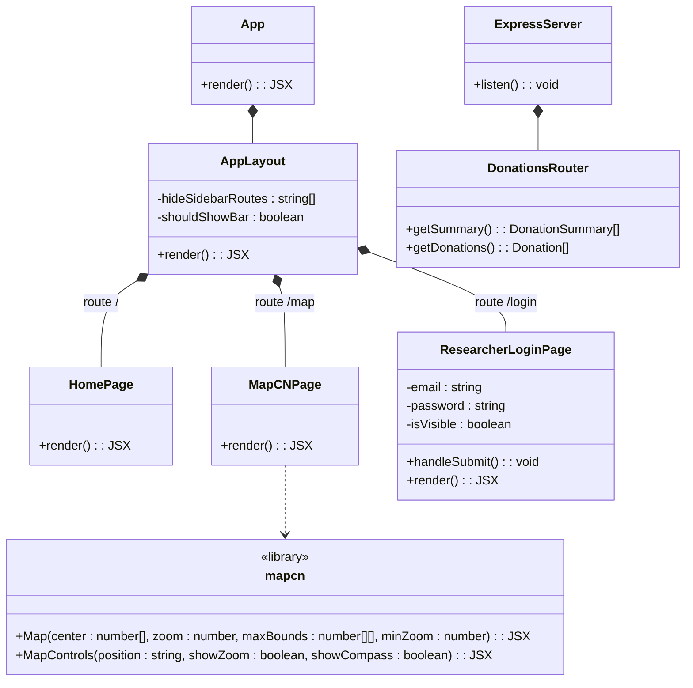

## Team Information

**Team Name:** The Unemployables

| Name |
|---|
| Ayyash Anhardeen |
| Akshayan |
| Faris |
| Tri |
| Tareq |

---

---

## Class Diagram

> Initial system architecture as of Demo 1. Database layer is stubbed — types are defined, queries are not yet implemented.
>
> Visibility: `+` public · `-` private · `#` protected

---

## What Was Completed (Demo 1)

- [x] Project scaffold — React + Express + TypeScript monorepo
- [x] Docker Compose file
- [x] Canada Map rendered
- [x] Express API route structure (temp)
- [x] Landing Page when users enters web app
- [x] Researcher login/signup frontend
- [x] Supabase Auth — researcher login/signup
## What Is Outstanding (moves to Demo 2)

- [ ] Python ingestion script to load Elections Canada CSVs into Supabase

