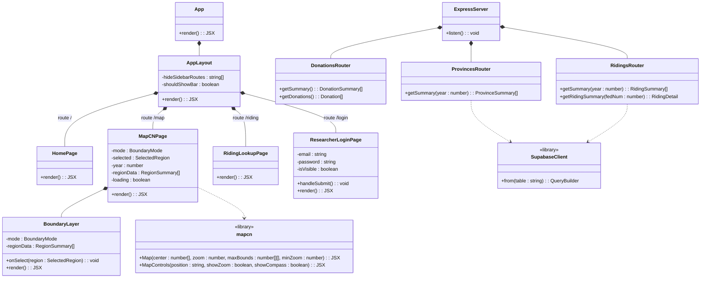

## Class Diagram

> Updated for Demo 2.
>
> Visibility: `+` public · `-` private · `#` protected

---

## What Was Completed (Demo 2)

- [x] Province choropleth map — donation totals by province with year selector
- [x] Electoral district choropleth map — donation totals by riding with year selector
- [x] Province info panel — total donations, donor count, party breakdown
- [x] Riding lookup page — all-time and per-year donation detail for a single riding
- [x] Supabase data ingestion — 5.4M donation rows (2004–2024)
- [x] Postal code → riding lookup table (883K rows via PCFRF)
- [x] Pre-aggregated riding summary table (riding_party_summary) for fast queries
- [x] Automated tests — server grouping logic and client formatting utilities

## What Is Outstanding (moves to Demo 3)

- [ ] Year trend chart in riding/province info panel
- [ ] Per-capita donation normalization using census population data
- [ ] Filter donations by party on the map
