## Class Diagram

> Updated for Demo 4.
>
> Visibility: `+` public · `-` private · `#` protected

```mermaid
classDiagram

    %% ── Frontend ──────────────────────────────────────────

    class App {
        +render() : JSX
    }

    class AppLayout {
        -hideSidebarRoutes : string[]
        -shouldShowBar : boolean
        +render() : JSX
    }

    class HomePage {
        +render() : JSX
    }

    class AboutPage {
        +render() : JSX
    }

    class NotFoundPage {
        +render() : JSX
    }

    class MapCNPage {
        -mode : BoundaryMode
        -selected : SelectedRegion
        -selectedYears : number[]
        -selectedParty : string | null
        -searchQuery : string
        -geoFeatures : GeoFeature[]
        -flyToCode : string | null
        -regionData : RegionSummary[]
        -trendData : YearSummary[]
        -loading : boolean
        +render() : JSX
    }

    class BoundaryLayer {
        -mode : BoundaryMode
        -regionData : RegionSummary[]
        -selectedCode : string | null
        +onSelect(region : SelectedRegion) : void
        +render() : JSX
    }

    class FlyToRegion {
        -flyToCode : string | null
        -features : GeoFeature[]
        -mode : BoundaryMode
        +render() : JSX
    }

    class RidingLookupPage {
        -selectedRiding : RidingMeta | null
        -summary : RidingSummary | null
        -selectedYears : number[]
        -metric : "total" | "average"
        -compareRiding : RidingMeta | null
        -page : number
        +render() : JSX
    }

    class DonationTrendsPage {
        -selectedYear : number
        -selectedProvince : string
        -yearRows : ChartRow[]
        -monthRows : ChartRow[]
        -hidden : Set~string~
        -chartType : "line" | "bar" | "pie"
        +render() : JSX
    }

    class ResearcherPage {
        -filters : DonationFilters
        -results : Donation[]
        -page : number
        -loading : boolean
        +handleSearch() : void
        +handleDownload() : void
        +render() : JSX
    }

    class ResearcherLoginPage {
        -email : string
        -password : string
        -isVisible : boolean
        +handleSubmit() : void
        +render() : JSX
    }

    class mapcn {
        <<library>>
        +Map(center : number[], zoom : number, maxBounds : number[][], minZoom : number) : JSX
        +MapControls(position : string, showZoom : boolean, showCompass : boolean) : JSX
    }

    class recharts {
        <<library>>
        +LineChart(data : ChartRow[]) : JSX
        +BarChart(data : ChartRow[]) : JSX
        +PieChart(data : ChartRow[]) : JSX
        +XAxis(dataKey : string) : JSX
        +YAxis() : JSX
        +ResponsiveContainer(width : string, height : number) : JSX
    }

    %% ── Backend ──────────────────────────────────────────

    class ExpressServer {
        +listen() : void
    }

    class DonationsRouter {
        +getSummary() : DonationSummary[]
        +getDonations(filters : DonationFilters, page : number) : Donation[]
        +downloadDonations(filters : DonationFilters) : CSV
        +getSumByYearParty() : DonationYearPartySum[]
        +getSumByMonth(year : number) : DonationMonthPartySum[]
        +getSumByProvinceYear(province : string) : DonationYearPartySum[]
        +getSumByProvinceMonth(province : string, year : number) : DonationMonthPartySum[]
    }

    class LoggingRouter {
        +logSearch(userId : string, filters : DonationFilters) : void
        +logDownload(userId : string, filters : DonationFilters) : void
        +logAccess(userId : string, recordId : string) : void
        +verifyToken(token : string) : boolean
    }

    class ProvincesRouter {
        +getSummary(years : number[], party? : string) : ProvinceSummary[]
        +getProvinceSummary(code : string) : ProvinceYearDetail
    }

    class RidingsRouter {
        +getRankings() : RidingRankingsResponse
        +getSummary(years : number[], party? : string) : RidingSummary[]
        +getRidingSummary(fedNum : number) : RidingDetail
    }

    class SupabaseClient {
        <<library>>
        +from(table : string) : QueryBuilder
    }

    class province_year_total {
        <<materialized view>>
        +province : string
        +year : number
        +total_monetary : number
        +donation_count : number
        +donor_count : number
    }

    class province_party_year_total {
        <<materialized view>>
        +province : string
        +party : string
        +year : number
        +total_monetary : number
        +donation_count : number
        +donor_count : number
    }

    class riding_year_total {
        <<materialized view>>
        +fed_num : number
        +year : number
        +total_monetary : number
        +donation_count : number
        +donor_count : number
    }

    class riding_party_summary {
        <<materialized view>>
        +fed_num : number
        +party : string
        +year : number
        +total_monetary : number
        +donation_count : number
        +donor_count : number
    }

    %% ── Relationships ─────────────────────────────────────

    App *-- AppLayout
    AppLayout *-- HomePage : route /
    AppLayout *-- AboutPage : route /about
    AppLayout *-- NotFoundPage : route *
    AppLayout *-- MapCNPage : route /map
    AppLayout *-- RidingLookupPage : route /riding
    AppLayout *-- DonationTrendsPage : route /donation-trends
    AppLayout *-- ResearcherPage : route /advanced-filters
    AppLayout *-- ResearcherLoginPage : route /login
    MapCNPage *-- BoundaryLayer
    MapCNPage *-- FlyToRegion
    MapCNPage ..> mapcn
    DonationTrendsPage ..> recharts
    ExpressServer *-- DonationsRouter
    ExpressServer *-- LoggingRouter
    ExpressServer *-- ProvincesRouter
    ExpressServer *-- RidingsRouter
    DonationsRouter ..> SupabaseClient
    LoggingRouter ..> SupabaseClient
    ProvincesRouter ..> SupabaseClient
    ProvincesRouter ..> province_year_total
    ProvincesRouter ..> province_party_year_total
    RidingsRouter ..> SupabaseClient
    RidingsRouter ..> riding_year_total
    RidingsRouter ..> riding_party_summary
```

---

## What Was Completed (Demo 4)

- [x] Map search — type a province or district name to jump directly to it; the map flies to the region's bounds and highlights it with a white overlay and border
- [x] Researcher dashboard logging — all searches, downloads, and record accesses by authenticated users are recorded
- [x] CSV export of donation records from the researcher dashboard
- [x] Pagination for researcher results
- [x] Input validation on researcher filters (date ranges, negative amounts)
- [x] About page with project information
- [x] Collapsible navbar and 404 page for unknown routes
- [x] Home page improvements and navigation links
- [x] Monthly average over multiple selected years in Donation Trends
- [x] Direct link from the map info panel to the Donation Trends page
- [x] Expanded automated tests — 66 server + 93 client passing

## Test Screenshots

**Server tests (66 tests):**

**Client tests (93 tests):**

---
